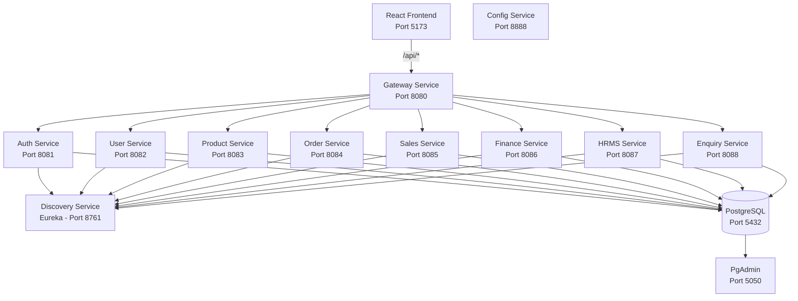
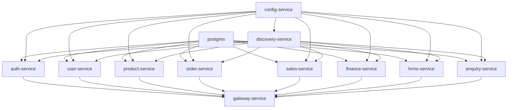

# Comprehensive Project Analysis - ERP SMB UI

**Analysis Date:** December 20, 2025  
**Project:** ERP SMB (Small and Medium Business) Platform  
**Repository:** pratapnarayan/erp-smb

---

## 📋 Executive Summary

This is a **full-stack Enterprise Resource Planning (ERP) system** designed for small and medium businesses. The project implements a **microservices architecture** with a React-based frontend and Spring Boot backend services.

### Key Characteristics
- **Architecture:** Microservices with API Gateway pattern
- **Frontend:** React 18 + Vite (Single Page Application)
- **Backend:** Spring Boot 3.3.4 + Java 21
- **Database:** PostgreSQL 16 with schema-per-service isolation
- **Service Discovery:** Netflix Eureka
- **Deployment:** Docker Compose ready with multi-stage builds

---

## 🔄 Recent Changes (since Dec 2, 2025)

- Frontend
  - Added axios dependency to package.json
  - Vite dev server proxy configured to gateway at http://localhost:8080
- Backend
  - Added Reporting Service (port 9100) with endpoints under /v1/reports:
    - GET /definitions?category=...
    - GET /metrics?period=month|week
    - POST /run (queue a report run with format CSV|XLSX|PDF)
    - GET /runs (paged)
    - GET /runs/{id}
    - GET /runs/{runId}/exports and GET /exports/{id}/download
  - Explicit @RequestParam names added in ReportsController for category and period
  - Root docker-compose now includes reporting-service with persistent export storage at ./data/reports, and Eureka client config via SPRING_APPLICATION_JSON
  - Gateway route added for reports: /api/reports/** -> http://localhost:9100 (stripPrefix: true)
- Build/Config
  - Parent backend POM cleaned and modules enumerated correctly
  - All service application.yml files are valid YAML (no escaped newlines)

## 🏗️ Architecture Overview

### System Architecture



### Design Patterns
1. **API Gateway Pattern** - Single entry point via gateway-service
2. **Service Discovery** - Dynamic service registration with Eureka
3. **Database per Service** - Schema isolation (auth, users, products, orders, sales, finance, hrms, enquiry)
4. **Shared Library** - common-lib for JWT utilities and DTOs
5. **Configuration Management** - Centralized config service

---

## 📁 Project Structure

### Root Directory Layout
```
erp-smb-ui/
├── backend/              # Spring Boot microservices
├── frontend/             # Active React frontend source
├── infrastructure/       # Deployment scripts and configs
└── docker-compose.yml    # Main orchestration file
```

### Frontend Structure (Active: `frontend/src`)
```
src/
├── main.jsx              # React entry point
├── App.jsx               # Main application component
├── styles.css            # Global styles (7.7KB)
├── forms.css             # Form-specific styles
├── components/           # Reusable UI components
│   ├── AppShell.jsx      # Main layout shell
│   ├── Badge.jsx         # Status badges
│   ├── DataTable.jsx     # Data grid component
│   ├── FrostedCard.jsx   # Glassmorphism card
│   ├── KPIWidget.jsx     # Dashboard metrics
│   └── SearchInput.jsx   # Search component
└── pages/                # Feature pages
    ├── Login.jsx         # Authentication
    ├── Dashboard.jsx     # Main dashboard
    ├── Enquiry.jsx       # Lead management
    ├── Orders.jsx        # Order processing
    ├── Sales.jsx         # Sales tracking
    ├── Inventory.jsx     # Stock management
    ├── Finance.jsx       # Financial management
    ├── HRMS.jsx          # HR management
    ├── Admin.jsx         # Administration
    └── Settings.jsx      # User preferences
```

### Backend Structure
```
backend/
├── pom.xml                    # Parent Maven POM
├── common-lib/                # Shared utilities
│   └── src/main/java/com/erp/smb/common/
│       ├── dto/PageResponse.java
│       └── security/JwtUtils.java
├── config-service/            # Spring Cloud Config
├── discovery-service/         # Eureka Server
├── gateway-service/           # API Gateway + Security
└── [business-services]/       # 8 domain services
    ├── auth-service/          # Authentication & JWT
    ├── user-service/          # User management
    ├── product-service/       # Product catalog
    ├── order-service/         # Order processing
    ├── sales-service/         # Sales analytics
    ├── finance-service/       # Financial operations
    ├── hrms-service/          # HR & payroll
    └── enquiry-service/       # Lead/enquiry tracking
```

Each business service follows this structure:
```
[service-name]/
├── Dockerfile
├── pom.xml
└── src/main/
    ├── java/com/erp/smb/[domain]/
    │   ├── [Service]Application.java
    │   ├── config/SecurityConfig.java
    │   ├── domain/[Entity].java
    │   ├── repo/[Repository].java
    │   └── web/[Controller].java
    └── resources/
        ├── application.yml
        └── db/migration/
            ├── V1__init_tables.sql
            └── V2__seed_demo.sql
```

---

## 🔧 Technology Stack

### Frontend Technologies
| Technology | Version | Purpose |
|------------|---------|---------|
| **React** | 18.3.1 | UI framework |
| **Vite** | 5.4.8 | Build tool & dev server |
| **Axios** | 1.7.7 | HTTP client |
| **Inter Font** | - | Typography (Google Fonts) |

**Notable:** No routing library (custom route state management), no state management library (using React hooks)

### Backend Technologies
| Technology | Version | Purpose |
|------------|---------|---------|
| **Java** | 21 | Programming language |
| **Spring Boot** | 3.3.4 | Application framework |
| **Spring Cloud** | 2023.0.3 | Microservices toolkit |
| **Netflix Eureka** | - | Service discovery |
| **PostgreSQL** | 16 | Primary database |
| **Flyway** | - | Database migrations |
| **JWT (jjwt)** | 0.11.5 | Authentication tokens |
| **MapStruct** | 1.5.5.Final | DTO mapping |
| **Testcontainers** | 1.20.1 | Integration testing |

### Infrastructure
| Tool | Version | Purpose |
|------|---------|---------|
| **Docker** | - | Containerization |
| **Docker Compose** | 3.9 | Multi-container orchestration |
| **Maven** | 3.9.6 | Build automation |
| **PgAdmin** | 8 | Database management UI |

---

## 🔐 Security Architecture

### Authentication Flow
1. User submits credentials to `/api/auth/login`
2. Auth service validates against `auth.users` table
3. JWT access token generated (1 hour TTL)
4. Token stored in localStorage on frontend
5. Subsequent requests include token via interceptor
6. Gateway validates JWT before proxying to services

### Security Features
- **JWT-based authentication** with configurable secret
- **Role-based access control** (ADMIN, MANAGER, EMPLOYEE, VIEWER)
- **Password hashing** via Spring Security
- **Token interceptor** on frontend (axios)
- **Security filters** on gateway and services
- **Schema isolation** prevents cross-service data access

### Configuration
- JWT Secret: `APP_JWT_SECRET` environment variable
- Default: `dev-secret-please-change-32-chars-minimum-123456`
- Access Token TTL: 3600 seconds (1 hour)

---

## 🗄️ Database Architecture

### Schema Design
PostgreSQL database with **schema-per-service** isolation:

| Schema | Service | Purpose |
|--------|---------|---------|
| `auth` | auth-service | User credentials & authentication |
| `users` | user-service | User profiles & metadata |
| `products` | product-service | Product catalog & inventory |
| `orders` | order-service | Order processing & tracking |
| `sales` | sales-service | Sales records & analytics |
| `finance` | finance-service | Financial transactions & reports |
| `hrms` | hrms-service | Employee records & payroll |
| `enquiry` | enquiry-service | Lead & enquiry management |

### Migration Strategy
- **Flyway** for version-controlled migrations
- Migrations located in `src/main/resources/db/migration/`
- Naming: `V1__init_tables.sql`, `V2__seed_demo.sql`
- **Validate-only mode** (`ddl-auto: validate`) prevents accidental schema changes

### Database Configuration
```yaml
datasource:
  url: jdbc:postgresql://postgres:5432/erp
  username: ${POSTGRES_USER:erp}
  password: ${POSTGRES_PASSWORD:erp}
jpa:
  hibernate:
    ddl-auto: validate
flyway:
  enabled: true
  schemas: [service-specific]
```

---

## 🌐 API Architecture

### Gateway Routing Configuration
The gateway service proxies requests to backend services:

| Route Pattern | Target Service | Port |
|---------------|----------------|------|
| `/api/auth/**` | auth-service | 8081 |
| `/api/users/**` | user-service | 8082 |
| `/api/products/**` | product-service | 8083 |
| `/api/orders/**` | order-service | 8084 |
| `/api/sales/**` | sales-service | 8085 |
| `/api/finance/**` | finance-service | 8086 |
| `/api/hrms/**` | hrms-service | 8087 |
| `/api/enquiry/**` | enquiry-service | 8088 |
| `/api/reports/**` | reporting-service | 9100 |

### Frontend API Client Structure
```javascript
// Base HTTP client with interceptors
import http from './clients/http.js';

// Service-specific API clients
export const authApi = {
  login: (username, password) => POST /auth/login
  signup: (username, password, role) => POST /auth/signup
  refresh: (refreshToken) => POST /auth/refresh
};

export const productsApi = {
  list: (page, size) => GET /products?page=X&size=Y
  create: (item) => POST /products
};

// Similar patterns for: usersApi, ordersApi, salesApi, 
// financeApi, hrmsApi, enquiryApi
```

### API Base URL
- **Development:** `/api` (proxied by Vite to gateway)
- **Production:** Configured via `API_BASE_URL` constant

---

## 🎨 Frontend Architecture

### Component Hierarchy
```
App (theme, auth, routing)
├── Login (unauthenticated)
└── AppShell (authenticated)
    ├── Sidebar (navigation)
    ├── Header (user menu, theme toggle)
    └── Content Area
        ├── Dashboard (KPIs, charts)
        ├── Enquiry (lead management)
        ├── Orders (order processing)
        ├── Sales (sales tracking)
        ├── Inventory (stock management)
        ├── Finance (financial management)
        ├── HRMS (employee management)
        ├── Admin (system administration)
        └── Settings (preferences)
```

### State Management
- **No external state library** (Redux, Zustand, etc.)
- Uses React hooks: `useState`, `useMemo`, `useEffect`
- **localStorage** for persistence:
  - `theme`: 'light' or 'dark'
  - `user`: JSON-serialized user object
  - `token`: JWT access token (via interceptor)

### Routing Strategy
- **Client-side routing** without React Router
- Route state managed via `useState('dashboard')`
- Navigation via `onNavigate(routeKey)` callback
- Routes defined in `routes` array with icons

### Styling Approach
- **Vanilla CSS** with CSS custom properties
- Theme support via `.app--light` / `.app--dark` classes
- **Glassmorphism effects** (frosted cards)
- **Inter font** from Google Fonts
- Responsive design (not mobile-first)

---

## 🐳 Docker & Deployment

### Docker Compose Services
The `docker-compose.yml` orchestrates 14 services:

**Infrastructure Services:**
1. **postgres** - PostgreSQL 16 database
2. **pgadmin** - Database management UI
3. **config-service** - Spring Cloud Config
4. **discovery-service** - Eureka server

**Application Services:**
5. **gateway-service** - API Gateway
6. **auth-service** - Authentication
7. **user-service** - User management
8. **product-service** - Products
9. **order-service** - Orders
10. **sales-service** - Sales
11. **finance-service** - Finance
12. **hrms-service** - HR
13. **enquiry-service** - Enquiries
14. **reporting-service** - Reporting

### Multi-Stage Dockerfile Pattern
Each service uses a consistent Dockerfile:
```dockerfile
# Stage 1: Build all modules
FROM maven:3.9.6-eclipse-temurin-21 AS build
WORKDIR /app
COPY pom.xml .
COPY [all-services] ./
RUN mvn -q -f pom.xml -pl [service] -am package -DskipTests

# Stage 2: Runtime
FROM eclipse-temurin:21-jre
WORKDIR /opt/app
COPY --from=build /app/[service]/target/*.jar app.jar
EXPOSE [port]
ENTRYPOINT ["java","-jar","/opt/app/app.jar"]
```

### Service Dependencies


### Environment Variables
```bash
POSTGRES_USER=erp
POSTGRES_PASSWORD=erp
APP_JWT_SECRET=dev-secret-please-change-32-chars-minimum-123456
```

---

## ⚠️ Issues & Observations

### ✅ Resolved Issues

Based on the latest analysis, several previously identified critical and medium-priority issues have been **resolved**:

1.  ✅ **SQL Migration Files Correctly Formatted:** The SQL migration files no longer contain escaped newline characters (`\n`) and are correctly parsed by Flyway.
2.  ✅ **Frontend Proxy is Configured:** The `frontend/vite.config.ts` file now includes a proxy to the backend gateway (`http://localhost:8080`), enabling local development.
3.  ✅ **Gateway Build Plugin is Present:** The `gateway-service/pom.xml` correctly includes the `spring-boot-maven-plugin`, allowing it to be packaged as an executable JAR.
4.  ✅ **Dual Frontend Setup is Resolved:** The project has been consolidated to a single frontend configuration located in the `/frontend` directory, removing ambiguity.
5.  ✅ **Other Previous Fixes:** Issues noted in `PROJECT_ANALYSIS.md` (e.g., missing axios, POM formatting) also remain resolved.

### 🔍 Current Observations

#### 1. **No Frontend Build in Docker Compose** 🟡 MEDIUM
- **Issue:** `docker-compose.yml` only defines backend services.
- **Impact:** The frontend must be run as a separate process during development. A fully containerized, single-command startup is not possible.
- **Recommendation:** Add a service (e.g., using nginx) to the `docker-compose.yml` file to build and serve the frontend application.

#### 2. **No API Documentation** 🟡 MEDIUM
- **Issue:** No OpenAPI/Swagger configuration was detected in the backend services.
- **Impact:** Developers must read the source code to understand API contracts, which slows down development and increases the risk of integration errors.
- **Recommendation:** Add `springdoc-openapi` to the backend services to automatically generate API documentation.

#### 3. **Incomplete Common Library** 🟢 LOW
- **Issue:** The `common-lib` shared library is minimal, containing only `JwtUtils` and `PageResponse`.
- **Observation:** This could be expanded to include common DTOs, exception handlers, base repository interfaces, or audit entities to reduce code duplication across microservices.
- **Impact:** Potential for code duplication and inconsistencies between services.

#### 4. **Hardcoded Service URLs in Gateway** 🟢 LOW
- **Issue:** The gateway's configuration likely uses hardcoded URLs to connect to backend services (e.g., `http://auth-service:8081`).
- **Observation:** While Eureka is used for service registration, the gateway could leverage it for dynamic service discovery instead of relying on static URLs.
- **Impact:** The current setup is less flexible and resilient. Dynamic discovery would better support scaling and load balancing.

---

## 📊 Code Quality Metrics

### Frontend
- **Total Components:** 6 reusable components
- **Total Pages:** 10 feature pages
- **Styling:** ~8.6KB CSS (styles.css + forms.css)
- **Dependencies:** Minimal (3 runtime deps)
- **Bundle Size:** Not measured (recommend `npm run build` to check)

### Backend
- **Total Services:** 11 (3 infrastructure + 8 business)
- **Lines of Code:** Not measured (recommend SonarQube analysis)
- **Test Coverage:** Unknown (tests exist with Testcontainers)
- **Code Style:** Standard Spring Boot conventions

### Architecture Metrics
- **Service Coupling:** Low (shared only via common-lib)
- **Database Coupling:** None (schema isolation)
- **API Versioning:** None detected
- **Error Handling:** Standard Spring Boot exception handling

---

## 🚀 Getting Started

### Prerequisites
```bash
# Required
- Java 21
- Maven 3.9+
- Node.js 18+
- Docker & Docker Compose
- PostgreSQL 16 (or use Docker)

# Optional
- PgAdmin (or use Docker)
```

### Development Workflow

**Option 1: Full Docker Compose**
```bash
# Start all services
docker-compose up --build

# Access points:
# - Frontend: http://localhost:5173 (if added to compose)
# - Gateway: http://localhost:8080
# - Eureka: http://localhost:8761
# - PgAdmin: http://localhost:5050
```

**Option 2: Hybrid (Backend in Docker, Frontend local)**
```bash
# Terminal 1: Start backend services
docker-compose up postgres pgadmin config-service discovery-service gateway-service auth-service user-service product-service order-service sales-service finance-service hrms-service enquiry-service

# Terminal 2: Start frontend
npm install
npm run dev
# Access: http://localhost:5173
```

**Option 3: Full Local Development**
```bash
# Terminal 1: PostgreSQL
docker run -d -p 5432:5432 -e POSTGRES_DB=erp -e POSTGRES_USER=erp -e POSTGRES_PASSWORD=erp postgres:16

# Terminal 2-12: Start each service
cd backend/config-service && mvn spring-boot:run
cd backend/discovery-service && mvn spring-boot:run
cd backend/gateway-service && mvn spring-boot:run
# ... repeat for all services

# Terminal 13: Frontend
npm run dev
```

### Build Commands
```bash
# Backend: Build all services
cd backend
mvn clean package

# Frontend: Build production bundle
npm run build
npm run preview  # Test production build
```

---

## 📝 Recommendations

### Priority 1: Development Experience
1. 📦 **Add frontend Docker build** - Create a fully containerized, single-command startup.
2. 📚 **Add API documentation** - Add Springdoc OpenAPI to services.
3. 🧪 **Document testing strategy** - Explain how to run backend and frontend tests.
4. 📖 **Update README** - Add a comprehensive setup guide reflecting the current state.

### Priority 2: Production Readiness

### Priority 2: Development Experience
4. 📚 **Add API documentation** - Springdoc OpenAPI
5. 🧪 **Document testing strategy** - How to run tests
6. 📖 **Update README** - Add comprehensive setup guide
7. 🔧 **Add development scripts** - `start-backend.sh`, `start-frontend.sh`

### Priority 3: Production Readiness
8. 🔒 **Externalize secrets** - Use Docker secrets or vault
9. 📊 **Add monitoring** - Spring Boot Actuator + Prometheus
10. 🚨 **Add centralized logging** - ELK stack or similar
11. 🔄 **Add health checks** - Docker healthcheck directives
12. 🌐 **Add API versioning** - `/api/v1/...`

### Priority 4: Code Quality
13. 🧹 **Add code formatting** - Prettier (frontend), Spotless (backend)
14. 🔍 **Add linting** - ESLint (frontend), Checkstyle (backend)
15. 📏 **Add code coverage** - Jest (frontend), JaCoCo (backend)
16. 🏗️ **Expand common-lib** - Reduce code duplication

### Priority 5: Architecture Enhancements
17. 🔄 **Use Eureka for service discovery in gateway** - Remove hardcoded URLs
18. 📦 **Add frontend Docker build** - Complete containerization
19. 🔐 **Add refresh token rotation** - Enhanced security
20. 📱 **Add mobile responsiveness** - Improve UI/UX

---

## 🎯 Business Domain Coverage

The application covers these ERP modules:

| Module | Status | Features |
|--------|--------|----------|
| **Authentication** | ✅ Implemented | Login, signup, JWT tokens |
| **User Management** | ✅ Implemented | User CRUD, role-based access |
| **Product Catalog** | ✅ Implemented | Product listing, creation |
| **Order Processing** | ✅ Implemented | Order management |
| **Sales Tracking** | ✅ Implemented | Sales analytics |
| **Finance** | ✅ Implemented | Financial transactions, KPIs |
| **HRMS** | ✅ Implemented | Employee management |
| **Enquiry/CRM** | ✅ Implemented | Lead tracking |
| **Inventory** | ⚠️ Partial | UI exists, backend unclear |
| **Reporting** | ✅ Implemented | Report definitions, run queueing, metrics, CSV exports |
| **Notifications** | ❌ Not detected | No notification service |
| **Audit Logging** | ❌ Not detected | No audit trail |

---

## 📚 Documentation Status

| Document | Status | Location |
|----------|--------|----------|
| README | ⚠️ Exists | `/README.md` (not reviewed) |
| API Docs | ❌ Missing | - |
| Architecture Diagram | ✅ Created | This document |
| Setup Guide | ⚠️ Partial | README likely has some info |
| Deployment Guide | ❌ Missing | - |
| Development Guide | ❌ Missing | - |
| Database Schema | ⚠️ In migrations | `/backend/*/src/main/resources/db/migration/` |

---

## 🔗 Useful Links & Resources

### Project Files
- [Root POM](file:///d:/Projects/erp-smb-ui/backend/pom.xml) - Parent Maven configuration
- [Docker Compose](file:///d:/Projects/erp-smb-ui/docker-compose.yml) - Service orchestration
- [Frontend Entry](file:///d:/Projects/erp-smb-ui/frontend/src/main.jsx) - React application entry
- [Gateway Config](file:///d:/Projects/erp-smb-ui/backend/gateway-service/src/main/resources/application.yml) - API routing

### Key Components
- [App Shell](file:///d:/Projects/erp-smb-ui/frontend/src/components/AppShell.jsx) - Main layout
- [API Client](file:///d:/Projects/erp-smb-ui/frontend/src/api/clients/index.js) - HTTP client
- [JWT Utils](file:///d:/Projects/erp-smb-ui/backend/common-lib/src/main/java/com/erp/smb/common/security/JwtUtils.java) - Token handling

### Infrastructure Scripts
- [BOM Check Script](file:///d:/Projects/erp-smb-ui/infrastructure/scripts/check_bom_and_escapes.ps1) - File encoding validation

---

## 📞 Next Steps

To proceed with this project, consider:

1. **Review Outstanding Observations** - Address the remaining medium and low-priority issues.
2. **Containerize the Frontend** - Add the frontend service to `docker-compose.yml`.
2. **Run the Application** - Test end-to-end functionality
3. **Review Previous Analysis** - Check `PROJECT_ANALYSIS.md` for additional context
4. **Prioritize Enhancements** - Based on business requirements
5. **Establish Development Workflow** - Document and standardize

---

**Analysis Completed:** This comprehensive analysis provides a complete overview of the ERP SMB project architecture, technology stack, structure, and recommendations for improvement.
